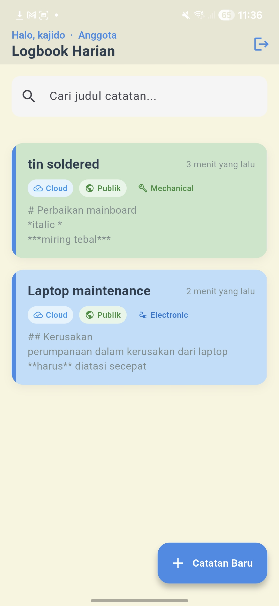
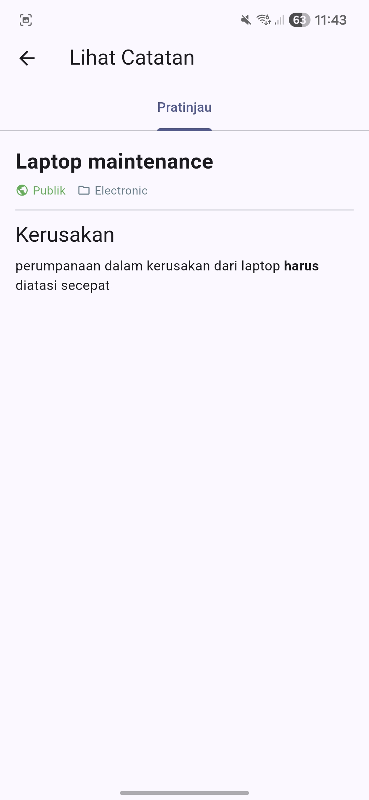
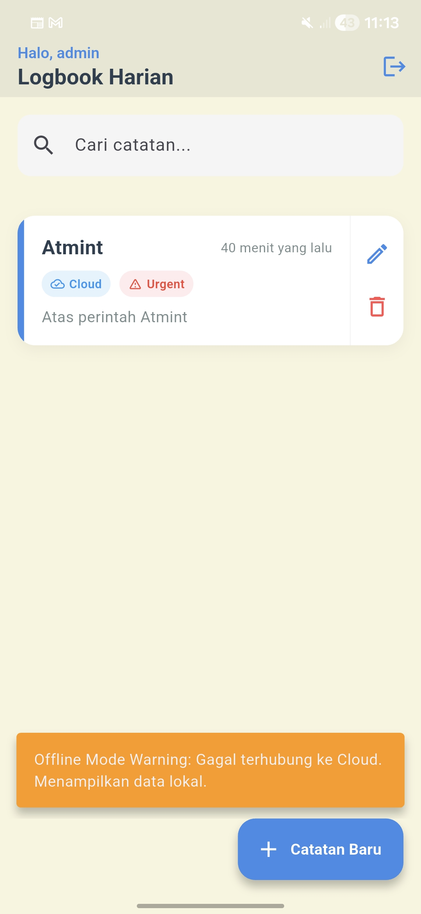
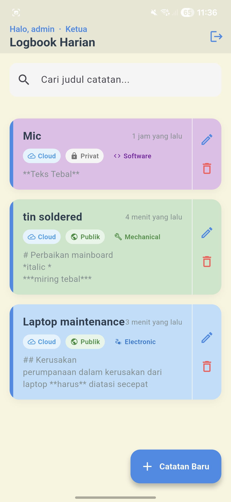
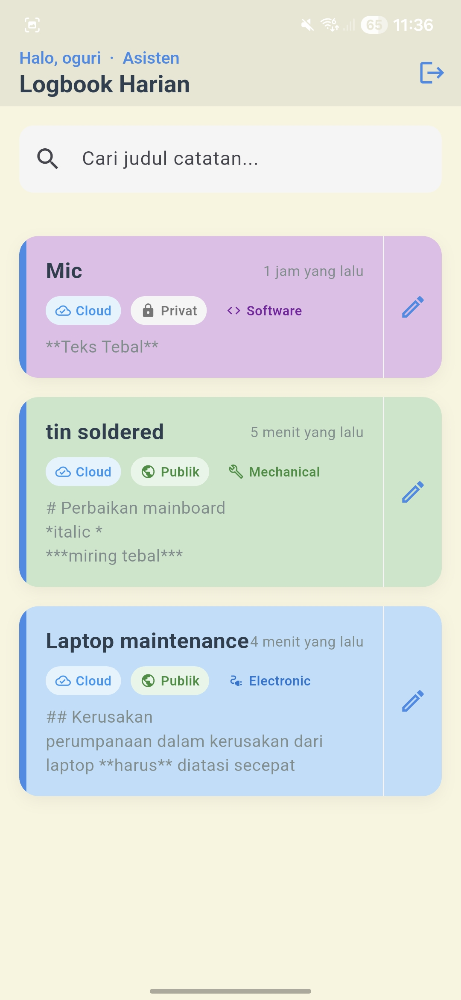
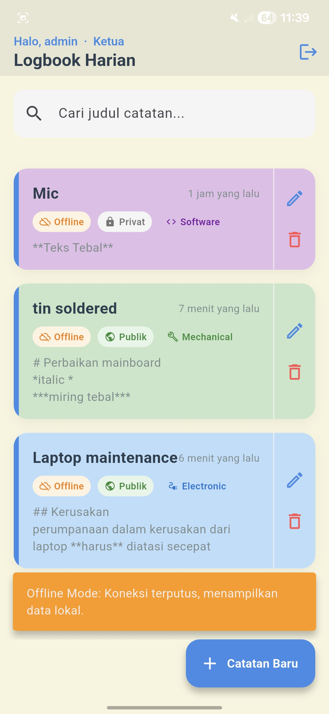
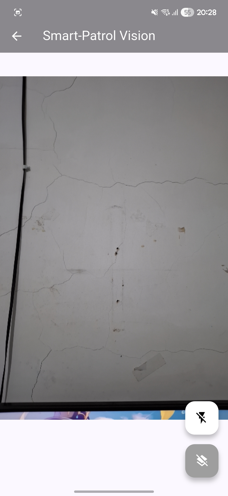
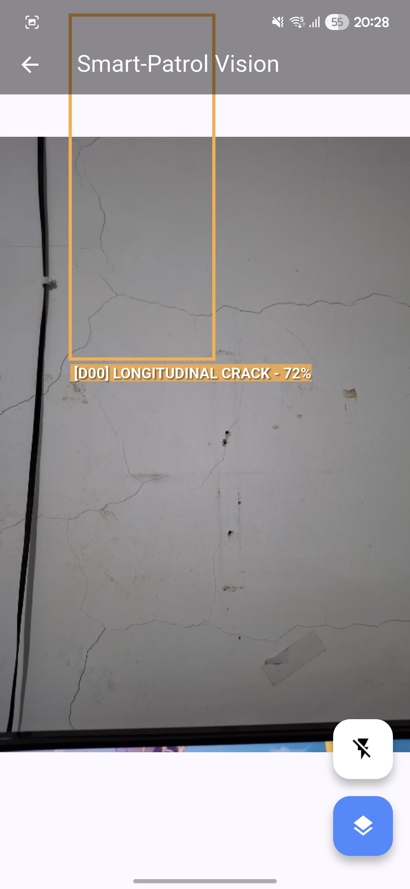
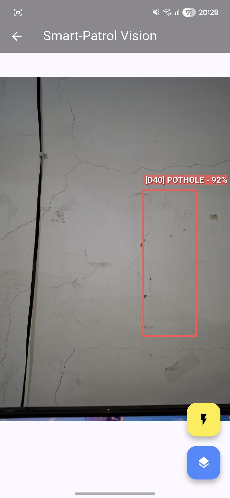

# logbook_app_093
## Modul 6v2_Part 1

        

---

## Konfigurasi `.env`

```env
MONGODB_URI=<uri-atlas>
MONGODB_DB_NAME=logbook_db
MONGODB_COLLECTION_NAME=logs
LOG_LEVEL=3
LOG_MUTE=connection_test.dart,mongo_service.dart
```

---

## Fitur

| # | Fitur | Keterangan |
|---|-------|------------|
| 1 | 🚀 **Onboarding** | Slideshow 3 halaman sebelum masuk ke login |
| 2 | 🔐 **Login + Auto-lock** | Maks. 3x gagal → tombol terkunci 10 detik |
| 3 | 🛡️ **RBAC** | Ketua (full), Anggota (CRUD milik sendiri), Asisten (Read+Update) |
| 4 | ☁️ **MongoDB Atlas** | CRUD cloud, singleton, race condition lock, timeout 20s |
| 5 | 📦 **Offline-First (Hive)** | Cache lokal ditampilkan instan, sync cloud di background |
| 6 | 📡 **Konektivitas Real-Time** | Auto-sync saat koneksi pulih, notifikasi snackbar |
| 7 | 🔍 **Search Real-Time** | Filter judul & deskripsi menggunakan `ValueNotifier` |
| 8 | 🏷️ **Kategori + Color Coding** | Dropdown Mechanical/Electronic/Software, warna & ikon per kategori |
| 9 | ✍️ **Markdown Editor** | Tab Editor + Pratinjau live, mode Read-Only untuk tamu |
| 10 | 🔒 **Privasi Catatan** | Toggle Publik/Privat per catatan |
| 11 | 🎬 **Empty State (Lottie)** | Animasi + tombol buat catatan saat list kosong |
| 12 | 🗑️ **Swipe-to-Delete** | Geser kiri untuk hapus, snackbar konfirmasi |
| 13 | 🔄 **Pull-to-Refresh** | Tarik ke bawah untuk sync manual dari cloud |
| 14 | 📋 **Audit Logging** | Level ERROR/INFO/VERBOSE, konfigurasi via `LOG_LEVEL` & `LOG_MUTE` |
| 15 | 📷 **Camera Sensor & Lifecycle** | Akses live camera preview dengan proteksi pemakaian resource (App Lifecycle) |
| 16 | 🎯 **Digital Overlay (CustomPainter)** | Tampilan bounding box, crosshair, dan dynamic text interface untuk deteksi AI |
| 17 | 🤖 **AI Mock Detector** | Simulasi deteksi objek dengan pergerakan lokasi secara acak setiap 3 detik |