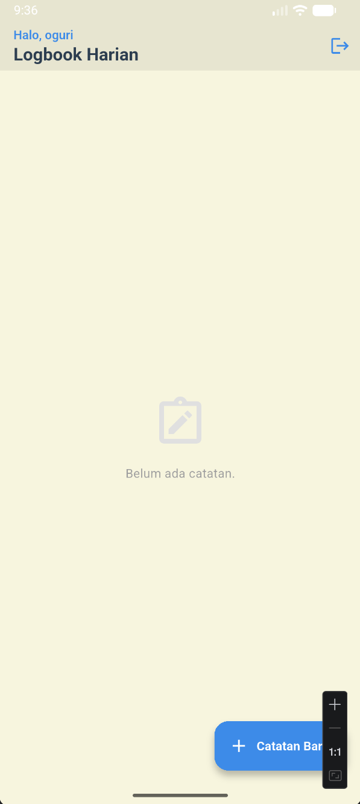
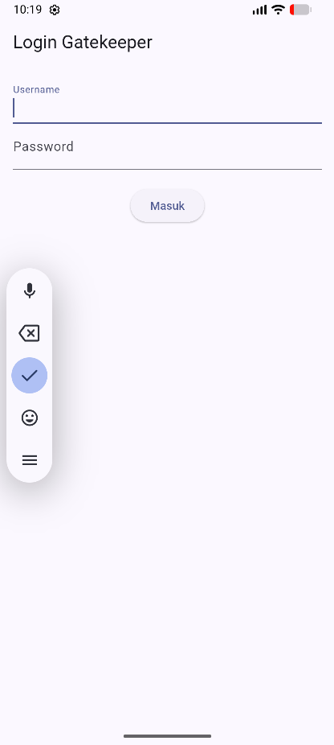
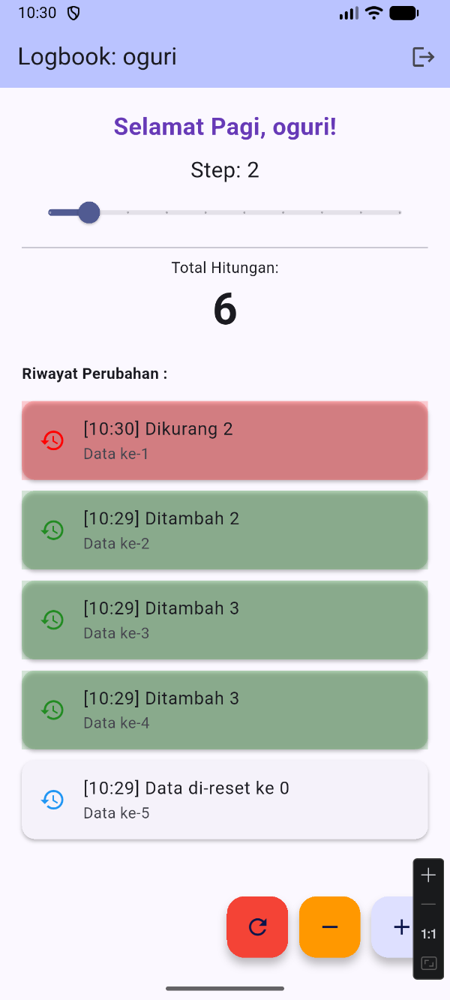
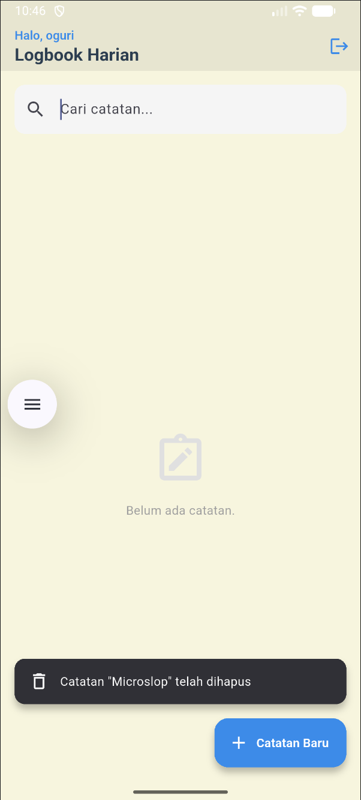

# logbook_app_093
---
## Modul 4_Part 1

   

## Konfigurasi .env (Audit Logging)

Tambahkan key berikut di file `.env`:

```env
MONGODB_URI=<uri-atlas>
MONGODB_DB_NAME=logbook_db
MONGODB_COLLECTION_NAME=logs
LOG_LEVEL=3
LOG_MUTE=connection_test.dart,mongo_service.dart
```

Catatan:
- `LOG_LEVEL=3` -> log tampil juga di terminal (verbose mode).
- `LOG_LEVEL=1/2` -> log tetap masuk debug logger, tapi terminal di-mute.
- `LOG_MUTE` berisi daftar source (dipisah koma) untuk disembunyikan dari output log.
